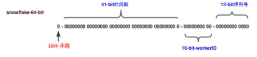
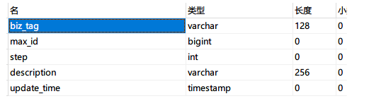

## 技术相关

### 1.分布式事务

分布式事务用于处理两个不同的系统之间的数据一致问题

**理论模型：2pc和3pc**

#### 1.1 理论模型-两阶段提交（2pc）和三阶段提交（3pc）

##### 1.1.1二阶段提交（2pc）

一阶段目的：先向两个系统发soon给预提交信息，用于确定此时两个系统是否能正常工作，若两个系统都收到了yes，则正常执行提交


情况：

1.一阶段中任一系统反馈no或者没反馈（超时），则直接回滚（正常结束）

2.二阶段中任一系统或者系统与协调者在执行完真正提交后，系统崩溃，则出现数据不一致

eg.支付系统已经提交sql，但是在反馈的时候系统失败，TM无法再回滚支付系统。或者TM崩溃，也无法进行

缺点：

1.单点故障问题（TM）

2.资源占据问题（在一阶段到二阶段的期间，数据库资源是一致被占据的）

3.数据不一致

##### 1.1.2三阶段提交（3pc）

一阶段目的：先向两个系统发送给询问信息，用于确定此时两个系统是否能正常工作，若两个系统都收到了yes，则正常执行提交，可以避免资源的占用（因为没有预提交）


三阶段相对于二阶段：

1.增加了询问，减少了资源的锁定

2.增加了超时判断

2.1 RM返回超时，则中断

2.2 TM超时，RM收不到继续操作的信息，继续（因为有了一阶段的询问，此时成功的可能性很大）

#### 1.3 解决方案1-LCN

LCN2阶段架构


LCN 2阶段流程图


### 2.分布式Session

分布式session问题情景：

如果用户的登录请求被打到了服务器1，但是下单情况被打到了服务器2，则会造成下单失败


解决方案

#### 2.1 IP哈希

利用nginx的ip哈希策略，使来自同一ip的服务打到同一台服务器上

缺点：单点故障，并且资源会倾斜至一台服务器上

不好用

#### 2.2 session复制

同步两个tomcat里面的session资源

缺点：会造成带宽浪费

#### 2.3 session中心

使用redis来存储session

缺点：单点故障

### 3.基于大型，多表的项目（电商）-分布式数据库优化

#### 3.1 换数据库

#### 3.2 分库分表（读写分离）

##### 3.2.1 jdbc应用层

侵入性强，但是效率高

shardingsphere，tddl

##### 3.2.2 proxy代理层

侵入性弱，但是支持多语言

#### 3.3 解决方案

##### 3.2.1 frameMark 前端静态化技术

通过提前（定时任务）生成静态化的前端模板，然后放置在cdn区，可以减少对数据库的访问压力。

缺点：在更改模板的时候，需要一次性重新生成大量静态页面，不适于大型项目

##### 3.2.2 redis多级缓存

redis是基于内存的，但是数据库是基于磁盘的，通过减少磁盘IO可以加速访问，减少数据库压力

###### 3.2.2.1缺点以及解决方案：

1.数据一致性问题：只要涉及了数据复制的情景，都需要考虑数据的一致性问题

1.1 最终一致性：设置超时时间

1.2 实时一致性

2.内存优化问题：

优化序列化的方案可以减少在网络IO中的传输时间，而且可以减少内存的占用

方案1. messagePack代替json（可以减少内存占用）

```
<!--redis内存压缩-->
<dependency>
    <groupId>org.msgpack</groupId>
    <artifactId>msgpack-core</artifactId>
    <version>0.8.20</version>
</dependency>
<dependency>
    <groupId>org.msgpack</groupId>
    <artifactId>jackson-dataformat-msgpack</artifactId>
    <version>0.8.20</version>
</dependency>
```

重写序列化

```java
class MsgPackRedisSerializer<T> implements RedisSerializer<T> {
    public static final Charset DEFAULT_CHARSET;
    private final JavaType javaType;
    private ObjectMapper objectMapper = new ObjectMapper(new MessagePackFactory())
            .registerModules(new Jdk8Module(), new JavaTimeModule())
            .configure(SerializationFeature.WRITE_DATES_AS_TIMESTAMPS, true)
            .configure(SerializationFeature.FAIL_ON_EMPTY_BEANS, false)
            .configure(DeserializationFeature.FAIL_ON_UNKNOWN_PROPERTIES, false)
            .setSerializationInclusion(JsonInclude.Include.NON_NULL);
 
    public MsgPackRedisSerializer(Class<T> type) {
        this.javaType = JavaTypeHandler.getJavaType(type);
    }
 
    public T deserialize(@Nullable byte[] bytes) throws SerializationException {
        if (bytes == null || bytes.length == 0) {
            return null;
        } else {
            try {
                return this.objectMapper.readValue(bytes, 0, bytes.length, this.javaType);
            } catch (Exception ex) {
                throw new SerializationException("Could not read MsgPack JSON: " + ex.getMessage(), ex);
            }
        }
    }
 
    public byte[] serialize(@Nullable Object value) throws SerializationException {
        if (value == null) {
            return new byte[0];
        } else {
            try {
                return this.objectMapper.writeValueAsBytes(value);
            } catch (Exception ex) {
                throw new SerializationException("Could not write MsgPack JSON: " + ex.getMessage(), ex);
            }
        }
    }
 
    static {
        DEFAULT_CHARSET = StandardCharsets.UTF_8;
    }
 
}
```

多级缓存里面需要防止数据直接打到mysql需要添加 4.分布式锁

###### 3.2.2.2 多级缓存伪代码实现以及存在的问题

```java
import org.redisson.Redisson;
import org.redisson.api.RLock;
import org.redisson.api.RedissonClient;
import org.redisson.config.Config;

public class ReentrantLockExample {
    public static void main(String[] args) {
        Config config = new Config();
        config.useClusterServers()
                .addNodeAddress("redis://127.0.0.1:7181");
        RedissonClient redisson = Redisson.create(config);

        // controller
        public data test(){
            if(redis.getData()){
				return data; // 能从redis获取缓存数据则直接返回
            }
            // 获取锁
             RLock lock = redisson.getLock("anyLock");
        	try {
            	// 支持自动续租
            	lock.lock();
                // 从数据库取数据
                data = mysql.getdata();
                // 塞缓存
                redis.setdata(data,timeout); // 问题在这，这里超时的时候如果请求过多则会发生缓存击穿
                return data;
            	// 处理业务逻辑
       	 	} finally {
           	 	if(lock.isHeldByCurrentThread()){
                 	lock.unlock(); // 只许自己释放
            	}  
        	}
        }
    }
}
```

###### 3.2.2.3 新增jvm本地缓存（但是自己实现的话会没有过期时间，于是使用guava包，可以设置初始，最大容量以及过期时间）

###### 3.2.2.4 防止缓存击穿，布隆过滤器

就是在项目启动的时候将数据库的数据（仅仅id）获取到jvm内存，然后再实现拦截器，拦截获取信息的请求，走内存获取

```
afterPropertySet(){
	jvmCache,put(data.id)
}

Intercetoper(){
	if(url.equal(/getId)){
		jvmCahce.get(data.id)
	}
}
```

###### 3.2.2.5 openresty ,nginx层的动态页面缓存

适用场景： 静态的商品展示页面之类

利用nginx层实现的缓存技术，将一些基本的页面信息，如商品名称等预先加载到静态html页面上面


### 4.分布式锁

#### 4.1 基于redis的分布式锁

##### 4.1.1 问题的演变

方案一：使用JVM或JDK级别的锁【synchronized】

问题：使用synchronized的加锁，如果是单机环境的话没有问题，但是对于集群/分布式环境则会出问题，对于跨tomcat就会锁不住。

```java
@RestController
public class IndexControlelr {

    @Autowired
    private Redisson redisson;
    @Autowired
    private StringRedisTemplate stringRedisTemplate;

    @RequestMapping("/deduct_stock")
    public String deductStock() {
  
        //以下的代码高并发场景下有问题
        synchronized(this) {
        int stock = Integer.parseInt(stringRedisTemplate.opsForValue().get("stock"));   //获取redis值  jedis.setnx(key.value)
        if (stock > 0) {
            int realStock = stock - 1;
            stringRedisTemplate.opsForValue().set("", realStock + "");   //设置redis值   jedis.set(key.value)
            Sysytem.out.printLn("扣减成功，剩余库存：" + realStock);
        } else {
            Sysytem.out.printLn("扣减失败，库存不足");
        }
      }
        return "end";
    }
}
```

方案二：为了解决方案一的问题，使用redis分布式锁的SETNX命令可以解决刚刚方案一的问题。

使用格式：setnx key value  将key的值设为value，当且仅当key不存在。若给定的key已存在，则SETNX不做任何操作。

问题：会出现死锁，就是当程序执行一般，中间的代码出现异常导致无法释放这把锁，此时就会出现死锁的现象。

```java
//使用redis分布式锁   
    @RequestMapping("/deduct_stock")
    public String deductStock() {
    
        String lockKey = "lockKey";
        boolean result = stringRedisTemplate.opsForValue().setIfAbsent(lockKey,"xl");
        if(!result){
            return "error_code";
        }
        //如果执行到这里下面的代码抛异常则无法完成释放锁，死锁产生
        int stock = Integer.parseInt(stringRedisTemplate.opsForValue().get("stock"));   //获取redis值  jedis.setnx(key.value)
        if (stock > 0) {
            int realStock = stock - 1; 
            stringRedisTemplate.opsForValue().set("", realStock + "");   //设置redis值  jedis.set(key.value)
            Sysytem.out.printLn("扣减成功，剩余库存：" + realStock);
        } else {
            Sysytem.out.printLn("扣减失败，库存不足");
        }
   
        //释放锁
        stringRedisTemplate.delete(lockKey);
      
        return "end";
    }
```

方案三：为了解决方案二的问题，设置key和操作时间+try ...catch...finally释放锁

问题：时间问题，高并发场景下此代码将就可以用了，但是会出现自己加的锁会被别人释放掉。

```java
@RequestMapping("/deduct_stock")
    public String deductStock() {
        
        String lockKey = "lockKey";
        
        try {
        //解决：给锁加一个超时时间，
        //boolean result = stringRedisTemplate.opsForValue().setIfAbsent(lockKey,"xl");
        //stringRedisTemplate.expire(lockKey,10,TimeUnit.SECONDS);
        //设置key和操作时间==保证原子性 将上面的两行合并为下面的一行
        boolean result = stringRedisTemplate.opsForValue().setIfAbsent(lockKey,"xl",10,TimeUnit.SECONDS);
        
        if(!result){
            return "error_code";
        }
        
        int stock = Integer.parseInt(stringRedisTemplate.opsForValue().get("stock"));   //获取redis值  jedis.setnx(key.value)
        if (stock > 0) {
            int realStock = stock - 1; 
            stringRedisTemplate.opsForValue().set("", realStock + "");   //设置redis值  jedis.set(key.value)
            Sysytem.out.printLn("扣减成功，剩余库存：" + realStock);
        } else {
            Sysytem.out.printLn("扣减失败，库存不足");
        }
        //解决释放锁的问题使用finally释放锁
        }funally {
        //释放锁
        stringRedisTemplate.delete(lockKey);
      }
        return "end";
    }
```

方案四：为了解决方案三的问题，生成UUID，将这个UUID设置到锁对应的value里面，自己加的锁只能自己释放，并在后台启动一个分线程每个一段时间（一般这个时间是你设置的超时时间的1/3，超时时间一般默认为30s）去检查一下主线程是否还持有这把锁，如果还持有这把锁的话就把设置的超时时间顺延30s

```java
@RequestMapping("/deduct_stock")
    public String deductStock() {
        
        String lockKey = "lockKey";
        //生成一个UUID
        String clientId = UUID.randomUUID().toString();
        
        try {
        //boolean result = stringRedisTemplate.opsForValue().setIfAbsent(lockKey,"xl");
        //stringRedisTemplate.expire(lockKey,10,TimeUnit.SECONDS);
        //将UUID设置到锁对应的value里面
        //这里的时间还是会存在问题==解决，在后台起一个分线程：起一个定时任务每10s(不超过30s，设置值的1/3时间）检查一下主线程是否还持有这把锁，
        //如果还持有把这个超时时间延长(重新设置30s),====>问题代码量太大了
        
        //解决方案：reddison框架底层的原理就是我们现在写的这些逻辑。
        //使用：pom直接引入依赖包即可，可以支持很多redis架构模式（主从，哨兵，高并发等）
        boolean result = stringRedisTemplate.opsForValue().setIfAbsent(lockKey,clientId,30,TimeUnit.SECONDS);
        
        if(!result){
            return "error_code";
        }
        
        int stock = Integer.parseInt(stringRedisTemplate.opsForValue().get("stock"));   //获取redis值  jedis.setnx(key.value)
        if (stock > 0) {
            int realStock = stock - 1; 
            stringRedisTemplate.opsForValue().set("", realStock + "");   //设置redis值  jedis.set(key.value)
            Sysytem.out.printLn("扣减成功，剩余库存：" + realStock);
        } else {
            Sysytem.out.printLn("扣减失败，库存不足");
        }
        //解决释放锁的问题使用finally释放锁
        }funally {
        //判断一下这把锁是不是自己加的锁（线程id）
        if (clientId.equals(stringRedisTemplate.opsForValue().get(lockKey))){
            stringRedisTemplate.delete(lockKey);
        }
      }
        return "end";
    }
    
}
```

上面是基于redis本身的设计

redission封装（redission主要就是解决了锁超时问题，看门狗机制，解锁的时候还是需要自己判断线程）

##### 4.1.2 redission锁场景

可重入锁非常适合那些需要连续几次访问一个资源的场景。例如，一个电商平台的订单创建过程中，从验证库存到最终下单可能需要多次进行资源锁定，可重入锁可以确保整个过程的同步执行

```java
import org.redisson.Redisson;
import org.redisson.api.RLock;
import org.redisson.api.RedissonClient;
import org.redisson.config.Config;

public class ReentrantLockExample {
    public static void main(String[] args) {
        Config config = new Config();
        config.useClusterServers()
                .addNodeAddress("redis://127.0.0.1:7181");
        RedissonClient redisson = Redisson.create(config);

        RLock lock = redisson.getLock("anyLock");
        try {
            // 支持自动续租
            lock.lock();
            // 处理业务逻辑
        } finally {
            if(lock.isHeldByCurrentThread()){
                 lock.unlock(); // 只许自己释放
            }
           
        }
    }
}

```

### 5.鉴权相关

#### 5.1单点登录

##### 5.1.1 jwt与redis的区别

两种实现单点登录的方式，一种是基于jwt（因为jwt上可以附加信息，所以可以直接在jwt上附加用户信息，这样就可以通过直接使用token获取用户信息，基于redis则是通过id直接从redis查询回来用户信息

### 6.订单技术

#### 6.1防重提交

##### 6.1.1 通过设定唯一的标识来进行防重（例如订单id）

##### 6.1.2 ABA问题，用户进行了两次修改，改回了最初状态，使用版本号进行处理，提交的时候判断前后端版本号是否一致，后台提交后版本号+1返回前端

#### 6.2 分库分表，搜索需求

##### 6.2.1 生成订单id的时候，最末两位使用用户id，这样就可以在分库分表的时候通过取模的方式快速找打对应用户（如果有找用户订单需求）

##### 6.2.2 使用es倒排索引

### 7. 共享资源

#### 7.1 公共资源处理

如果商品，优惠卷的扣减如何保证数量正常

##### 7.1.1 乐观锁 -- 版本号


### 8. 分布式ID方案

为什么需要一个分布式id，因为随着业务的增大，需要分库分表，而分库分表的情况下，单单使用表的主键来作为id已经无法满足需求，所以需要一个id可以去统一管理这些表。

对于这些id，应该满足一些基本的需求

- 全局唯一 （这个是基本的需求）
- 递增（可以是趋势，也可以是单调），但是建议是趋势，或者是单调的基础上对id进行加工，否则别人可以通过id的变化来确定你的数据量

#### 8.0 UUID （长度过长，舍弃）

#### 8.1 雪花算法及其衍生 

雪花算法

- 第 0 位： 符号位（标识正负），始终为 0，没有用，不用管。

- 第 1~41 位 ：一共 41 位，用来表示时间戳，单位是毫秒，可以支撑 2 ^41毫秒（约 69 年）

- 第 42~52 位 ：一共 10 位，一般来说，前 5 位表示机房 ID，后 5 位表示机器 ID（实际项目中可以根据实际情况调整），这样就可以区分不同集群/机房的节点，这样就可以表示 32 个 IDC，每个 IDC 下可以有 32 台机器。

- 第 53~64 位 ：一共 12 位，用来表示序列号。 序列号为自增值，代表单台机器每毫秒能够产生的最大 ID 数(2^12 = 4096),也就是说单台机器每毫秒最
  多可以生成 4096 个 唯一 ID。

  优点是不需要依赖数据库的网络和磁盘IO，但是的话需要多台机器的时间一致，当然可以通过zookeeper来改造让时间强一致

  



#### 8.2 美团leaf-segment方案

原 MySQL 方案每次获取 ID 都得读写一次数据库，造成数据库压力大。改为批量获取，每次获取一个 segment(step 决定大小)号段的值。用完之后再去数据
库获取新的号段，可以大大的减轻数据库的压力。各个业务不同的发号需求用 biz_tag 字段来区分，每个 biz-tag 的 ID 获取相互隔离，互不影响。如果以后有性能需求需要对数据库扩容，不需要上述描述的复杂的扩容操作，只需要对 biz_tag 分库分表就行。




简单来说

第一台机器启动，取了0 - 10000 step 号码去使用，同时把step改成10000，下一台机器用的时候就是10001-10002，依次进行，并且大家使用的同样的时间

**问题**

直接这样使用的话会出现毛刺现象，就是在每次step用完的时候，会突然出现一次网络IO和磁盘IO

解决方法就是使用双缓冲，在第一个step即将使用完的时候，提前去把下一个step申请好

#### 8.3 cosID分布式主键方案

### 9 .读写分离和分库分表

因为无法完全使用reids来替换mysql来使用数据库的功能，但是又需要提升数据的读取速度，所以需要读写分离和分库分表

#### 9.1 读写分离

主流是使用shardingsphere框架，mysql本身已经有主从的配置关系了，主节点打开binlog日志，从节点就可以从主节点更新数据，

shardingsphere的目的将主节点和从节点的数据整合成一个读写分离的逻辑数据库

**缺点：**

从节点同步主节点数据需要时间（网络IO），因此需要通过业务手段去（例如跳转完成页面）给从节点同步的时间，从而使数据一致


## 业务相关

### 1.如何做好表设计

### 


